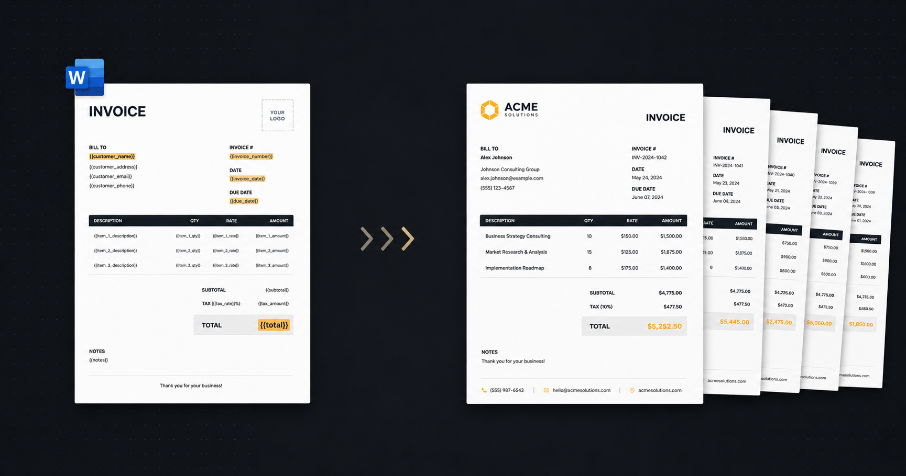

# Qorstack Report

<p align="center">
  
</p>

Generate PDF and Excel reports from DOCX and XLSX templates through a REST API.
Qorstack Report is self-hostable with Docker Compose and runs with PostgreSQL,
MinIO, and Gotenberg.

---

## Quick Start

The self-host setup lives in `selfhost/`. It includes PostgreSQL, MinIO,
font-syncer, Gotenberg, backend, and frontend in one Docker Compose file.

### Requirements

| Requirement    | Minimum |
| -------------- | ------- |
| Docker         | 24+     |
| Docker Compose | v2      |
| RAM            | 2 GB    |
| Disk           | 5 GB    |

### Run it

```bash
git clone https://github.com/qorstack/qorstack-report.git
cd qorstack-report/selfhost
cp .env.example .env
docker compose up -d
```

Open:

| Service       | URL                                            |
| ------------- | ---------------------------------------------- |
| Web UI        | [http://localhost:3000](http://localhost:3000) |
| API           | [http://localhost:8080](http://localhost:8080) |
| MinIO console | [http://localhost:9001](http://localhost:9001) |

Sign in with the default admin account: `admin` / `admin`.

See [report.qorstack.com/self-host](https://report.qorstack.com/self-host) for the
full guide: production secrets, access from another machine, external
PostgreSQL/MinIO, Pro license activation, updating, stopping, and troubleshooting.

---

## For AI Agents

Deploying or integrating Qorstack with an AI agent (Claude, Cursor, etc.)?

- **[AGENTS.md](AGENTS.md)** — deploy, create an API key, the `X-API-Key` render
  flow, when to use Qorstack vs. Gotenberg, and a copy-paste prompt to have your
  AI set it all up.
- **[mcp/](mcp/README.md)** — a Model Context Protocol server exposing list/generate
  tools, so MCP-capable agents drive Qorstack natively instead of hand-writing REST calls.
- **[llms.txt](llms.txt)** — machine-readable summary.

---

## Features

| Feature                                 | Open Source | Pro |
| --------------------------------------- | :---------: | :-: |
| DOCX templates to PDF / DOCX generation |     ✅      | ✅  |
| XLSX templates to XLSX / PDF generation |     ✅      | ✅  |
| Template management                     |     ✅      | ✅  |
| Font management and sync                |     ✅      | ✅  |
| Projects with RBAC                      |     ✅      | ✅  |
| Authentication                          |     ✅      | ✅  |
| API keys per project                    |     ✅      | ✅  |
| Analytics and generation history        |     ✅      | ✅  |
| PDF password protection                 |     ⛔      | ✅  |
| PDF watermarking                        |     ⛔      | ✅  |
| Live Preview auto-render                |     ⛔      | ✅  |
| Template version history (10 versions)  |     ⛔      | ✅  |
| Download / export results as ZIP        |     ⛔      | ✅  |

---

## Template Syntax

DOCX and XLSX templates use the same `{{variable}}` syntax.
See the full reference at [report.qorstack.com/docs](https://report.qorstack.com/docs).

---

## Documentation

| Document              | Link                                                                                           |
| --------------------- | ---------------------------------------------------------------------------------------------- |
| API Reference         | [backend/documents/02_API-REFERENCE.md](backend/documents/02_API-REFERENCE.md)                 |
| DOCX Template Guide   | [backend/documents/03_TEMPLATE-GUIDE.md](backend/documents/03_TEMPLATE-GUIDE.md)               |
| Excel Template Engine | [backend/documents/09_EXCEL-TEMPLATE-ENGINE.md](backend/documents/09_EXCEL-TEMPLATE-ENGINE.md) |
| SDK Usage             | [sdk/README.md](sdk/README.md)                                                                 |
| AI Agents & MCP       | [AGENTS.md](AGENTS.md), [mcp/README.md](mcp/README.md)                                         |
| Changelog             | [CHANGELOG.md](CHANGELOG.md)                                                                   |

---

## Tech Stack

| Layer       | Technology                                             |
| ----------- | ------------------------------------------------------ |
| Frontend    | Next.js 16, React 19, TypeScript, Tailwind CSS, HeroUI |
| Backend     | C# .NET 10, ASP.NET Core, Entity Framework Core        |
| Database    | PostgreSQL 16                                          |
| Storage     | MinIO                                                  |
| DOCX engine | Open XML SDK and custom template processor             |
| XLSX engine | ClosedXML                                              |
| PDF engine  | Gotenberg 8                                            |
| Auth        | JWT and OAuth                                          |

---

## Roadmap

- **Shipped** — REST API; DOCX/XLSX → PDF/DOCX/XLSX; multi-arch images (incl. Apple Silicon); AGENTS.md + MCP server; runnable examples.
- **Now** — lite single-container mode; latency benchmark vs. raw Gotenberg; clearer template-error messages.
- **Next** — MCP package on npm; Python & Go SDKs; batch generation API.
- **Exploring** — template marketplace; webhooks.

Want something prioritized? [Open an issue](https://github.com/qorstack/qorstack-report/issues).

---

## Development

For contributors who want to modify the application:

```bash
git clone https://github.com/qorstack/qorstack-report.git
cd qorstack-report
```

Start infrastructure:

```bash
docker compose -f docker-compose.infra.yml up -d
```

Run backend and frontend locally:

```bash
cd backend
dotnet restore
dotnet run --project src/Web
```

```bash
cd frontend
pnpm install
pnpm dev
```

---

## License

Qorstack Report is **open core**:

- All code in this repository is **MIT licensed** — see [LICENSE](LICENSE). You can
  self-host, modify, and use it commercially, for free.
- The optional **Pro** features ship as a separate closed-source module, activated
  by a paid `license.json` and governed by the
  [Commercial License](LICENSE-COMMERCIAL.md). Without a Pro license those features
  are simply disabled — the MIT core remains fully functional on its own.

See [LICENSING.md](LICENSING.md) for the full breakdown of what is free vs. Pro.
